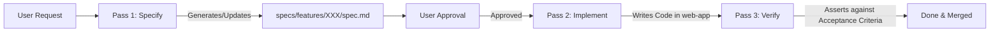

# Agent Rule: Spec-Driven Development (SDD)

This rule establishes **Spec-Driven Development (SDD)** as a mandatory software engineering discipline across the repository.

---

## 1. The Spec-First Principle

> [!IMPORTANT]
> **No implementation code shall be authored, modified, or refactored for new features or altered business rules without an approved specification in `specs/`.**

Before modifying application code (e.g., in `web-app/` or domain modules):
1. **Consult Existing Specs**: Search `specs/features/` and `specs/domain/` for the relevant capability.
2. **Author or Update the Spec**: If the spec does not exist or requires behavioral changes, draft/update the spec using the templates in `specs/templates/`.
3. **Obtain Approval**: Align with the user on the specification (data contracts, user flows, and Gherkin acceptance scenarios) *before* writing code.

---

## 2. Specification Hierarchy

The repository maintains a 3-tier hierarchy of intent:

1. **Strategic Intent** (`direction/`):
   - High-level North Star, 12 life areas, philosophy, roadmap (`VISION.md`, `ROADMAP.md`).
2. **Domain Invariants & Ubiquitous Language** (`specs/domain/`):
   - Foundation rules, math formulas (e.g., Priority Gap calculation), state transitions, aggregate root invariants.
3. **Feature Living Specs & Scenarios** (`specs/features/`):
   - Feature requirements, user flows, UI wireframe states, API/data contracts, and executable Gherkin acceptance criteria.

---

## 3. The 3-Step SDD Execution Loop

### Pass 1: Specify (Contract First)
- Activate product skills: `prod-requirements-analysis`, `prod-feature-design`, `prod-acceptance-criteria`.
- Draft or update `specs/features/<feature-id>/spec.md` using `specs/templates/feature-spec-template.md`.
- Ensure all acceptance criteria are formulated in unambiguous **Given / When / Then** Gherkin format.

### Pass 2: Implement (Clean Architecture)
- Activate architecture & engineering skills: `arch-modular-monolith`, `arch-cqrs`, `eng-implementation`, `tech-nuxt-development`.
- Implement strictly to satisfy the contracts and state machines defined in the spec.
- Avoid building unrequested features or deviating from spec bounds ("scope discipline").

### Pass 3: Verify (Living Spec Proof)
- Verify the implementation against every Gherkin scenario defined in the feature spec.
- Run automated tests (unit/integration) where applicable.
- If scope or requirements change during pair programming, update the spec artifact first so it remains the living truth.

---

## 4. Spec Status Taxonomy

Every document in `specs/features/` must include frontmatter or a status badge:
- `Status: Draft` — Work in progress, under active design.
- `Status: In Review` — Awaiting human review and alignment.
- `Status: Approved` — Ready for engineering implementation.
- `Status: Implemented` — Code complete and verified against acceptance criteria.
- `Status: Deprecated` — Superseded by a newer feature or domain specification.
