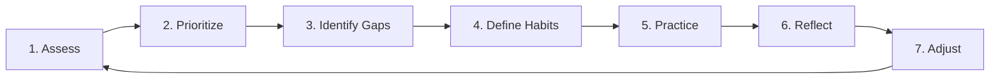
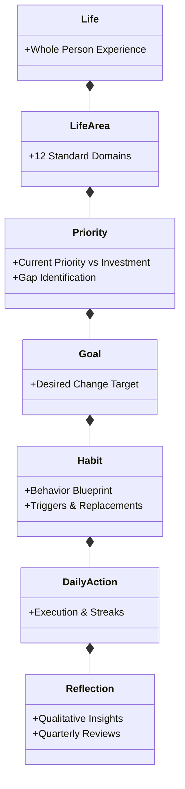

# Bona Loko (Habit & Life Balance)

> *"Understand what matters. Focus your attention. Build better habits. Shape the life you want to live."*

**Bona Loko** is an open-source personal development platform designed to bridge the gap between high-level life aspirations and daily actions. By combining holistic life assessment, multi-dimensional priority modeling, distraction management, and continuous reflection, the platform helps people consciously decide where to invest their finite time and energy.

---

## 🎯 The Core Philosophy

Most productivity and habit systems suffer from a fundamental disconnect: **they track daily checklist items in isolation from what actually matters in a person's life.** Completing ten arbitrary habits does not mean you are living the life you desire.

**Bona Loko** starts from first principles:
1. **Understanding what matters to you** (Defining personal values without judgment).
2. **Measuring where your attention actually goes** (Time and mental/physical energy).
3. **Closing the priority gaps** (Translating intentions into sustainable daily behaviors).

The system does not dictate what a "good life" looks like. Instead, it provides a structured canvas for each person to discover their own balance and direct their life intentionally.

---

## 🧭 Foundational Concepts

### 1. The 12 Life Areas Framework
Inspired by the Wheel of Life, the platform evaluates existence across 12 holistic life domains:

| Category | Life Areas |
| :--- | :--- |
| **Vitality & Self** | Health & Physical Fitness • Mental & Emotional Wellbeing • Personal Growth & Learning |
| **Work & Prosperity** | Career & Calling • Finances & Wealth • Physical Environment & Spaces |
| **Connection & Heart** | Relationships & Intimacy • Family & Parenting • Friendships & Community |
| **Attention & Spirit** | Recreation, Hobbies & Play • Focus & Attention Mastery • Contribution & Legacy |

---

### 2. Multi-Dimensional Priority Model
Rather than reducing life satisfaction to a simplistic 1-to-10 rating, each area is analyzed across five interconnected dimensions:

$$\text{Current Priority} \longrightarrow \text{Current State} \longrightarrow \text{Current Investment} \longrightarrow \text{Desired Investment} \longrightarrow \text{Priority Gap}$$

- **Current Priority**: How much priority does this area hold in your current moment of life?
- **Satisfaction**: How satisfied are you with its current state?
- **Current Investment**: How much time and energy do you realistically spend on it?
- **Desired Investment**: How much time and energy would you *like* to spend on it?
- **Intent**: Do you wish to **Improve**, **Maintain**, or consciously **Deprioritize** this area?

This model instantly highlights **Priority Gaps** — for example, where an area is critically important but receives negligible time, or where low-priority activities are absorbing disproportionate energy.

---

### 3. The 7 Core Values (Moral Bedrock)

All interactions, algorithms, and features are permanently guided by the 7 Core Values defined in [FOUNDATION.md](./FOUNDATION.md):

$$\text{Faith} \longrightarrow \text{Gratitude} \longrightarrow \text{Humility} \longrightarrow \text{Integrity} \longrightarrow \text{Respect} \longrightarrow \text{Empathy} \longrightarrow \text{Freedom}$$

- **Humility at Position #3**: *"True integrity naturally takes root in humility: seeing ourselves honestly and gently as we genuinely are creates the foundation for authentic alignment between our inner thoughts and outer actions."*
- Humility is the gentle foundation for authentic integrity: it dismantles ego, allows honest assessment of current limitations, and replaces performative perfection with patient, steady progress.

---

### 4. The 7-Step Transformation Engine

The platform moves users along a continuous, iterative personal growth cycle:



1. **Assess**: Map your current baseline across the 12 areas.
2. **Prioritize**: Distinguish high, medium, and low focal points.
3. **Identify Gaps**: Surface disparities between intent and daily reality.
4. **Define Habits**: Craft specific micro-behaviors designed to close identified gaps.
5. **Practice**: Track consistency, momentum, and schedules.
6. **Reflect**: Capture qualitative notes on friction, mood, and attention.
7. **Adjust**: Periodically realign priorities as life circumstances evolve.

---

### 4. Focus & Distraction Management
Time cannot be directed toward what matters if attention is continuously siphoned away by unintentional distractions. The system treats focus preservation as an essential pillar:
- **Distraction Inventory**: Identify personal attention leaks (compulsive phone checking, endless feeds, avoidance behaviors).
- **Trigger Awareness**: Uncover the contextual cues and emotions driving distractions.
- **Replacement Habits**: Replace destructive impulses with healthy substitutes.
- **Boundary Setting**: Establish protective digital curfews and deep-work boundaries.

---

### 5. Habit Anatomy
Every habit in **Bona Loko** is not just an isolated task, but an explicit behavioral bridge:

```
Life Area ──▶ Priority ──▶ Goal ──▶ Habit (Context + Trigger ──▶ Action ──▶ Reward)
```

Each habit includes:
- **Parent Life Area & Purpose**: Why this behavior exists.
- **Type**: Positive formation vs. Negative cessation / Replacement.
- **Frequency & Schedule**: Contextual cues (when and where).
- **Energy & Time Estimate**: Realistic friction budgeting.
- **Consistency Tracking**: Adherence and longitudinal momentum.

---

## 🏗️ Conceptual Domain Hierarchy



---

## 🚀 Product Roadmap

The project is developed across five strategic phases:

- **[Phase 1: Life Assessment](./direction/ROADMAP.md#phase-1--life-assessment-foundation)**: Wheel of Life balance visualization, multi-dimensional assessment questionnaire, baseline profile.
- **[Phase 2: Priority Management](./direction/ROADMAP.md#phase-2--priority-management-intentional-gaps)**: Gap analysis engine, focus area categorization, conscious deprioritization.
- **[Phase 3: Habits & Behavioral Bridge](./direction/ROADMAP.md#phase-3--habits--behavioral-bridge)**: Habit creation tied to life areas, consistency tracking, replacement routines.
- **[Phase 4: Focus & Distraction Management](./direction/ROADMAP.md#phase-4--focus--distraction-management)**: Distraction tracking, cue analysis, substitute workflows, attention recovery.
- **[Phase 5: Reflection & Continuous Improvement](./direction/ROADMAP.md#phase-5--reflection--continuous-improvement)**: Periodic reassessments, historical comparison views, long-term habit efficacy.

---

## 📂 Repository Navigation

- **[Platform Foundation & Values](https://github.com/assertivecode/bona-loko/blob/main/FOUNDATION.md)**: Moral constitution, 7 core values, and non-negotiable independence rules.
- **[Product Vision & Philosophy](./direction/VISION.md)**: In-depth vision, user personas, and domain invariants.
- **[Strategic Roadmap](./direction/ROADMAP.md)**: Milestone breakdowns and deliverables.
- **[Architecture Vision](./direction/ARCHITECTURE_VISION.md)**: Modular Monolith + CQRS technical design.
- **[Agent Operating Manual](./AGENTS.md)**: Pair-programming instructions and prompt shortcuts.
- **[Living Specifications (SDD)](./specs/README.md)**: Spec-Driven Development directory, domain models, and feature RFCs.
- **[Modular Skills Suite](./.agents/skills/README.md)**: Agentic knowledge packages and skill catalog.
