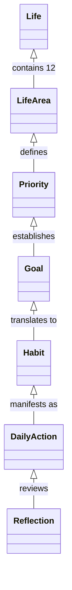

# Technical Architecture Vision: Habit & Life Balance

This document outlines the architectural principles, domain hierarchy, and system boundaries that govern the implementation of `bona-loko`.

---

## 1. Conceptual Domain Hierarchy

The architecture maintains an unbreakable chain of custody from overarching life purpose down to daily keystrokes and actions:



$$\text{Life} \longrightarrow \text{12 Life Areas} \longrightarrow \text{Priorities} \longrightarrow \text{Goals / Changes} \longrightarrow \text{Habits} \longrightarrow \text{Daily Actions} \longrightarrow \text{Progress \& Reflection}$$

Every entity in the system is rooted in this hierarchy. No habit may exist without an explicit reference to a Life Area and intended Priority impact.

---

## 2. Technical Architecture Pattern: Modular Monolith + CQRS

To maximize velocity without sacrificing domain clarity or future scalability, `bona-loko` is built as a **Modular Monolith** applying **CQRS** (Command Query Responsibility Segregation).

```
src/
├── Modules/
│   ├── Assessment/         <-- Life Areas, Evaluation, Gap Analysis
│   │   ├── Domain/
│   │   ├── Application/
│   │   │   ├── Commands/   <-- SubmitAssessmentCommand, UpdateRatingsCommand
│   │   │   └── Queries/    <-- GetLatestAssessmentQuery, GetLifeBalanceWheelQuery
│   │   └── Infrastructure/
│   │
│   ├── Priorities/         <-- Priority models, targets, goals
│   │   ├── Domain/
│   │   ├── Application/
│   │   └── Infrastructure/
│   │
│   ├── Habits/             <-- Habit definitions, schedules, daily tracking
│   │   ├── Domain/
│   │   ├── Application/
│   │   └── Infrastructure/
│   │
│   ├── Focus/              <-- Distractions, triggers, replacement habits
│   │   ├── Domain/
│   │   ├── Application/
│   │   └── Infrastructure/
│   │
│   └── Analytics/          <-- Longitudinal comparisons, reports, reviews
│       ├── Domain/
│       ├── Application/
│       └── Infrastructure/
│
└── Shared/
    ├── Contracts/          <-- In-process event contracts & public DTOs
    └── Kernel/             <-- Base Entity, ValueObject, AggregateRoot, Result
```

### Architectural Guardrails:
1. **Module Autonomy**: Each module owns its domain logic and EF Core mappings.
2. **In-Process Communication**: Cross-module interactions occur strictly via explicit public contracts or in-process domain event mediators (e.g. MediatR / Wolverine). Direct cross-module database table joins are prohibited.
3. **CQRS Separation**:
   - **Commands**: Encapsulate intent, validate business rules, mutate state through Aggregate Roots, and emit domain events.
   - **Queries**: Optimize for fast read-only projections directly mapped to UI views (e.g. Wheel of Life, Daily Habit Checklists).
4. **Clean Domain Core**: Domain entities and value objects have zero dependencies on web frameworks or ORMs.
