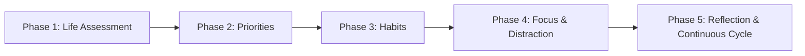

# Product Roadmap: Habit & Life Balance

This roadmap charts the strategic evolution of the Habit & Life Balance platform across five foundational phases.

---

## Thematic Roadmap Overview

---

## Phase Breakdown

### 🎯 Phase 1 — Life Assessment (Foundation)
**Objective**: Build the core assessment experience to capture the user's initial life profile across 12 areas.
- **Deliverables**:
  - Definition and modeling of the 12 holistic life areas.
  - Multi-dimensional assessment UI (Importance, Current Satisfaction, Current Time/Energy Investment, Desired Investment).
  - Wheel of Life balance visualization and baseline profile generation.
- **Success Criteria**: A new user can complete an assessment in under 10 minutes and view a comprehensive baseline map of their life.

---

### 🎯 Phase 2 — Priority Management (Intentional Gaps)
**Objective**: Transform static assessment scores into actionable priorities and highlighted gaps.
- **Deliverables**:
  - Priority gap calculation engine (comparing Importance vs. Current Investment).
  - Explicit priority categorization (High, Medium, Low focus areas).
  - Desired investment target setting and intentional deprioritization choices.
- **Success Criteria**: System automatically identifies top 3 priority gaps and generates personalized focal recommendations.

---

### 🎯 Phase 3 — Habits & Behavioral Bridge
**Objective**: Connect life area priorities directly to sustainable daily and weekly routines.
- **Deliverables**:
  - Habit creation workflow tied explicitly to parent life areas and priorities.
  - Scheduling, frequency, and time-estimate tracking.
  - Daily check-in interface with streak, momentum, and consistency metrics.
  - Support for both additive (positive) and reductive (negative) behaviors.
- **Success Criteria**: Every active habit has a clear link to a designated life area and stated purpose.

---

### 🎯 Phase 4 — Focus & Distraction Management
**Objective**: Protect user attention and reduce unintentional digital / behavioral leaks.
- **Deliverables**:
  - Distraction logging and pattern/trigger identification.
  - Replacement habit workflows (trigger -> substitute behavior).
  - Focus sessions and digital boundary guidelines.
  - Correlation metrics: Reduction in distractions vs. gain in priority time.
- **Success Criteria**: Users can track and visibly decrease time spent on top 2 self-identified distractions.

---

### 🎯 Phase 5 — Reflection & Continuous Improvement
**Objective**: Close the loop with periodic reassessments and longitudinal personal analytics.
- **Deliverables**:
  - Periodic reassessment engine (monthly / quarterly review prompts).
  - Longitudinal comparison views (Previous Assessment vs. Current Assessment).
  - Habit efficacy review: Are the habits actually moving the needle on life satisfaction?
  - Personal journaling and reflective retrospective prompts.
- **Success Criteria**: Users can review historical progress across quarters and realign habits with changing seasons of life.
