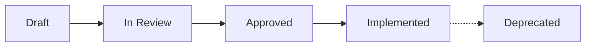

# Living Specifications (Spec-Driven Development)

Welcome to the **Bona Loko** Living Specifications directory. This directory serves as the **Single Source of Truth (SSOT)** for product behavior, domain models, and feature contracts.

---

## Why Spec-Driven Development?

1. **Focus & Alignment**: Prevents AI agents and engineers from guessing requirements, drifting from product vision, or making accidental breaking assumptions.
2. **Quality by Design**: Acceptance criteria are formulated in Gherkin (`Given-When-Then`) *before* writing code, serving as direct inputs to automated tests.
3. **Traceability**: Every code commit and PR maps directly to a version-controlled specification.

---

## Directory Structure

```text
specs/
├── README.md                           # This document
├── domain/                             # Core Domain Invariants & Ubiquitous Language
│   ├── core-values.spec.md             # 7 Core Values, Humility position, and moral architecture
│   ├── 12-life-areas.spec.md           # 12 Life Areas definitions, keys, and scope
│   ├── priority-model.spec.md          # Multi-dimensional investment & gap calculation model
│   └── habit-loop.spec.md              # Habit lifecycle, states, cadences, and mechanics
├── features/                           # Living Feature Specifications (RFC / PRD)
│   ├── 001-landing-page/               # Landing page value prop, preview, and i18n
│   ├── 002-dimension-article-view/     # Dimension article dynamic view and routing
│   ├── 003-monorepo-deployment-pipeline/ # Monorepo changeset and targeted deployment
│   └── 004-suggested-habits-view/      # Suggested habits showcase and dynamic articles
└── templates/                          # Reusable Spec Templates
    ├── feature-spec-template.md        # Feature specification scaffolding
    └── acceptance-criteria-template.md # Gherkin test scenarios scaffolding
```

---

## Spec Lifecycle & Statuses

Every feature spec progresses through distinct stages:



- `Draft`: Initial ideation and authoring using product skills.
- `In Review`: Submitted for pair review and human alignment.
- `Approved`: Frozen contract ready for architecture and engineering implementation.
- `Implemented`: Delivered to production and validated against all acceptance criteria.
- `Deprecated`: Archived or superseded by newer specifications.

---

## How to Author a New Spec

1. Copy [templates/feature-spec-template.md](./templates/feature-spec-template.md) into a new directory under `features/` (e.g., `features/002-life-assessment/spec.md`).
2. Activate the product skills bundle:
   - `prod-requirements-analysis`
   - `prod-feature-design`
   - `prod-acceptance-criteria`
3. Complete all mandatory sections: Problem, Scope, User Flows, Data Contracts, UI/UX States, and Gherkin Scenarios.
4. Mark status as `In Review` and seek human review before coding.
