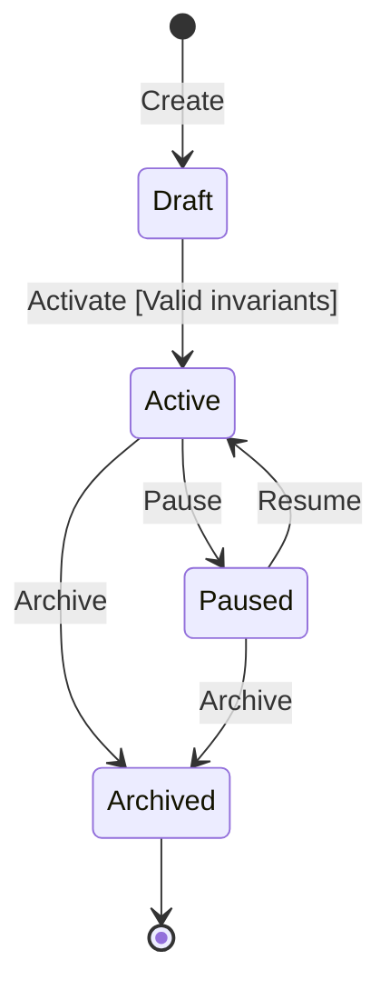

# Domain Specification: Habit Loop & State Machine

| Metadata | Details |
| :--- | :--- |
| **Domain Component** | Core Habit Engine Lifecycle & Mechanics |
| **Status** | `Approved` |
| **Related Vision** | [direction/VISION.md](../../direction/VISION.md) |

---

## 1. Domain Concept Overview

Habits are the actionable bridge that closes **Priority Gaps**. Rather than abstract resolutions, habits are small, repeatable routines anchored to a specific trigger and tied to one or more of the 12 Life Areas.

---

## 2. Habit State Machine

### State Definitions & Transitions
1. **`Draft`**: Habit is being configured (e.g., in a creation wizard). Incomplete fields allowed.
2. **`Active`**: Habit is actively scheduled for execution and daily check-ins.
   - *Transition Invariant*: Cannot transition to `Active` without:
     - Non-empty `title`
     - Valid `life_area_key` (must match one of 12 Life Areas)
     - Valid `cadence` (Daily, Weekly, or Specific Days)
     - Defined `target_frequency`
3. **`Paused`**: Temporarily frozen (e.g., during vacation or illness). Streak counts are preserved but overdue penalties/alerts are suspended.
4. **`Archived`**: Retired from the active board. Preserved for historical analytics and reflection logs.

---

## 3. The Habit Loop Anatomy

Every habit aggregate encapsulates the classical cue-routine-reward structure:

| Element | Description | Example |
| :--- | :--- | :--- |
| **Cue (Trigger)** | Contextual, time-based, or preceding habit anchor (habit stacking). | *"After I brew morning coffee..."* |
| **Routine (Behavior)** | The micro-action performed. | *"I will sit for 5 minutes of mindful breathing."* |
| **Reward / Identity Anchor** | The emotional reinforcement and identity statement. | *"I am a calm, centered thinker."* |
| **Minimum Viable Dose** | The 2-minute fallback version for low-energy days. | *"1 minute of deep breath if rushed."* |

---

## 4. Cadence & Check-in Logging

### 4.1 Supported Cadences
- `Daily`: Every calendar day.
- `Weekdays`: Monday through Friday.
- `Weekends`: Saturday and Sunday.
- `SpecificDays`: Set of days (e.g., `[Mon, Wed, Fri]`).
- `FlexibleWeekly`: Target completions per week (e.g., 3 times/week).

### 4.2 Check-in Log Entry
Each check-in entry records:
- `habit_id`: UUID
- `date`: ISO 8601 Date (`YYYY-MM-DD`)
- `status`: `Completed` | `Skipped` | `RestDay`
- `notes`: Optional reflection text
