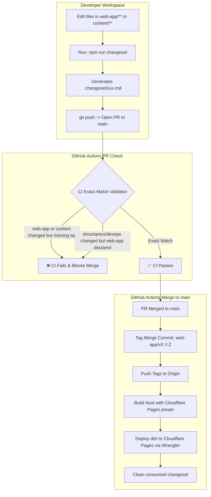

# Feature Specification: Web-App & Bundled Content Changeset, Path Filtering & Cloudflare Deployment Pipeline

| Metadata | Details |
| :--- | :--- |
| **Feature ID** | `feat-003` |
| **Status** | `Implemented` |
| **Author(s)** | Antigravity Pair |
| **Target Release** | Phase 1 (MVP) / CI-CD Infrastructure |
| **Target Deployments** | `web-app` -> Cloudflare Pages |

---

## 1. Problem Statement & Context

### 1.1 The User Problem
In the Bona Loko monorepo, markdown articles in `./content` are inlined directly into the JavaScript bundles at build time by Vite (`import.meta.glob`). Consequently:
- Any modification to application code in `web-app/**` OR to articles in `content/**` requires a new compilation and deployment to Cloudflare Pages for the changes to appear on the live site.
- Developers must explicitly declare deployment intent via lightweight changeset manifests when changing `web-app/**` or `content/**`.
- CI must strictly guard against human error: if files in `web-app/**` or `content/**` are modified, the PR must fail unless the `web-app` changeset tag is present. Conversely, if a changeset declares `web-app` when only pure documentation (`README.md`), specifications (`specs/**`), or CI/CD tooling (`devops/**`) changed, CI must fail to block unintended deployments.
- Merging to `main` must atomically tag the merge commit (`web-app/v<version>`) and trigger the deployment of `web-app` to Cloudflare Pages.

### 1.2 Alignment with Vision
Provides predictable, reproducible, and verifiable continuous integration and continuous delivery (CI/CD) infrastructure, upholding repository integrity and operational excellence.

---

## 2. Scope & Boundaries

### 2.1 In Scope
- **DevOps Directory Structure**: All operational scripts and configuration centralized under `devops/` (`devops/deploy-targets.json`, `devops/scripts/`).
- **Declarative App Registry** (`devops/deploy-targets.json`): Maps `web-app` to both `web-app/**` and `content/**` (because articles are bundled at compile time), and ignores documentation, specs, and devops tooling.
- **Local Changeset Generator** (`devops/scripts/changeset-create.mjs`): CLI for creating `.changeset/*.md` manifests with interactive and non-interactive modes.
- **Strict CI Path-Filtering Validator** (`devops/scripts/changeset-validate.mjs`): Enforces the exact-match invariant between git diff paths and declared changeset tags.
- **Merge Release & Multi-Tagging** (`devops/scripts/changeset-release.mjs`): Bumps `web-app/package.json` version, tags the merge commit (e.g. `web-app/v1.0.1`), outputs deployment manifest, and cleans consumed changesets.
- **GitHub Actions PR Workflow** (`.github/workflows/pr-validate-changeset.yml`): Blocks PR merges on validation failures.
- **GitHub Actions CD Workflow** (`.github/workflows/cd-deploy-on-merge.yml`): Builds Nuxt 3 with Nitro Cloudflare Pages preset and deploys `web-app/dist` to Cloudflare Pages using Wrangler action.

### 2.2 Out of Scope
- Standalone external CMS or dynamic database fetching for content articles (all content is statically bundled via Vite).

---

## 3. Workflow & Journey



---

## 4. Technical Contracts

### 4.1 Deployment Registry Schema (`devops/deploy-targets.json`)
```json
{
  "apps": {
    "web-app": {
      "name": "Web Application (Nuxt 3)",
      "paths": [
        "web-app/**",
        "content/**"
      ],
      "tagPrefix": "web-app",
      "versionFile": "web-app/package.json",
      "deployTarget": "cloudflare-pages",
      "cloudflareProject": "bona-loko"
    }
  },
  "ignoredPaths": [
    ".changeset/**",
    ".github/**",
    ".agents/**",
    "specs/**",
    "direction/**",
    "devops/**",
    "README.md",
    "AGENTS.md",
    "FOUNDATION.md",
    "GEMINI.md",
    ".gitignore",
    "package.json"
  ]
}
```

### 4.2 Changeset Manifest Contract (`.changeset/*.md`)
```markdown
---
"web-app": patch
---

Summary description of changes for release notes.
```

---

## 5. Acceptance Criteria (Gherkin Scenarios)

### Scenario 1: Exact Match Validation for Web App Code Passes
```gherkin
Given a PR branch that modifies files in "web-app/pages/index.vue"
And a changeset file exists in ".changeset/" declaring "web-app: patch"
When the CI changeset validator runs
Then the validation status should be SUCCESS (exit code 0)
And the CI check should pass
```

### Scenario 2: Missing Application Tag on Web App Code Fails CI
```gherkin
Given a PR branch that modifies files in "web-app/components/Card.vue"
And no changeset file exists in ".changeset/" (or changeset omits "web-app")
When the CI changeset validator runs
Then the validation status should be FAILURE (exit code 1)
And the error message should specify: "Missing deployment declaration for modified apps: [web-app]"
And the PR merge should be blocked
```

### Scenario 3: Missing Application Tag on Content Updates Fails CI
```gherkin
Given a PR branch that modifies files in "content/pt-br/dimensoes/saude-e-condicionamento-fisico.md"
And no changeset file exists in ".changeset/" (or changeset omits "web-app")
When the CI changeset validator runs
Then the validation status should be FAILURE (exit code 1)
And the error message should specify: "Missing deployment declaration for modified apps: [web-app]"
And the PR merge should be blocked
```

### Scenario 4: Content Update with Declared Changeset Passes CI
```gherkin
Given a PR branch that modifies files in "content/en-us/dimensions/health-and-fitness.md"
And a changeset file exists declaring "web-app: patch"
When the CI changeset validator runs
Then the validation status should be SUCCESS (exit code 0)
And the CI check should pass
```

### Scenario 5: Documentation / Specs / DevOps Only Changes
```gherkin
Given a PR branch that modifies only "README.md", "specs/features/001/spec.md", or "devops/deploy-targets.json"
And no changeset file is added to ".changeset/"
When the CI changeset validator runs
Then the validation status should be SUCCESS (exit code 0)
And the message should state: "No application code modified. No changeset required."
```

### Scenario 6: Unnecessary Changeset on Pure Documentation Fails CI
```gherkin
Given a PR branch that modifies only "README.md"
And a changeset file exists declaring "web-app: patch"
When the CI changeset validator runs
Then the validation status should be FAILURE (exit code 1)
And the error message should specify that unneeded deployments were declared
And the PR merge should be blocked
```

### Scenario 7: Tagging on Merge Commit & Cloudflare Deployment
```gherkin
Given a PR is merged into "main" containing an approved changeset for "web-app: patch"
When the CD release action executes
Then "web-app/package.json" version should be incremented
And a git tag "web-app/v<new_version>" should be created pointing to the merge commit SHA
And the tag should be pushed to the remote repository
And the Nuxt 3 web-app should be built with Nitro Cloudflare Pages preset and deployed
```
