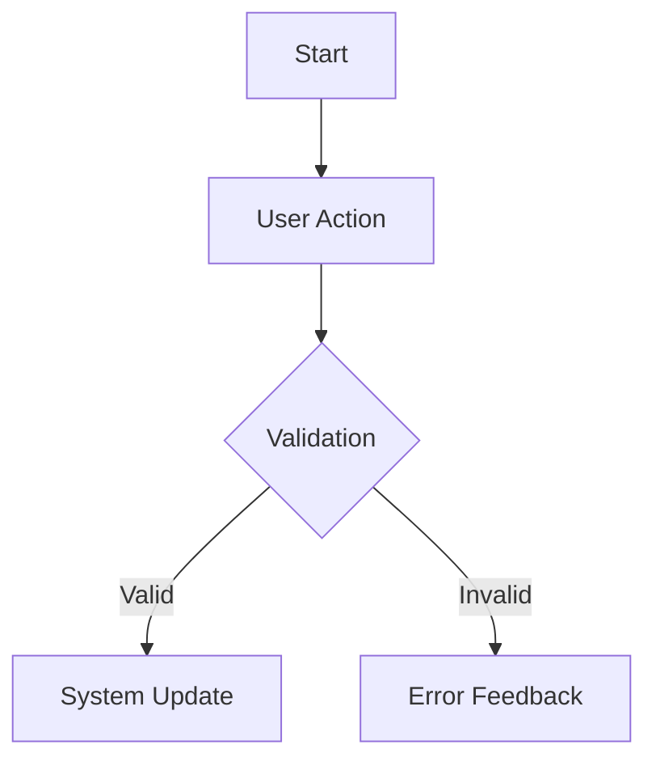

# Feature Specification: [Feature Name]

| Metadata | Details |
| :--- | :--- |
| **Feature ID** | `feat-xxx` |
| **Status** | `Draft` \| `In Review` \| `Approved` \| `Implemented` \| `Deprecated` |
| **Author(s)** | Antigravity Pair |
| **Target Release** | Phase 1 (MVP) / Milestone |
| **Related Specs** | [specs/domain/...](../domain/) |

---

## 1. Problem Statement & Context

### 1.1 The User Problem
- *What specific friction, gap, or pain point does this feature solve?*

### 1.2 Alignment with Vision
- *Which of the 12 life areas or core engine loops does this touch? (Refer to [direction/VISION.md](../../direction/VISION.md))*

---

## 2. Scope & Boundaries

### 2.1 In Scope
- [ ] Core capability 1
- [ ] Core capability 2

### 2.2 Out of Scope
- Explicit non-goals for this release or phase.

---

## 3. User Flows & Interaction Journey

### 3.1 Primary Happy Path
1. **Entry**: User navigates to ...
2. **Action**: User provides input ...
3. **Transition**: System validates and computes ...
4. **Outcome**: User views updated state ...



### 3.2 Error & Recovery Flows
- **Scenario A**: Input validation fails -> Clear inline guidance provided.
- **Scenario B**: Network disconnect -> Optimistic UI handles retry or informs user.

---

## 4. Domain & State Modeling

### 4.1 Entity States & Transitions
- `State 1` -> `State 2` via `Trigger/Command`
- Invariants that must NEVER be violated.

### 4.2 Ubiquitous Language & Vocabulary
| Term | Definition |
| :--- | :--- |
| `EntityName` | What it means in this context |

---

## 5. Technical Contracts

### 5.1 Command / Mutation Payloads (Write Model)
```json
{
  "id": "uuid",
  "name": "string",
  "value": 0
}
```

### 5.2 Query / Projection Models (Read Model)
```json
{
  "id": "uuid",
  "name": "string",
  "status": "active"
}
```

---

## 6. UI / UX Specifications

### 6.1 Layout & Visual Components
- Key visual sections, cards, modals, or forms.
- Responsive behaviors (mobile vs desktop).

### 6.2 Localization & i18n
- Support all three platform locales: `en-US`, `pt-BR`, `eo`.
- Translation keys defined.

---

## 7. Acceptance Criteria (Gherkin Scenarios)

### Scenario 1: Primary Happy Path
```gherkin
Given a user is on the ...
When they select ...
Then the system should ...
And the view should display ...
```

### Scenario 2: Validation & Boundary Limit
```gherkin
Given a user attempts to submit ...
When the value is out of bounds ...
Then a localized validation error should appear ...
And no state should be persisted
```

### Scenario 3: Locale Switch
```gherkin
Given the feature is rendered in English
When the user switches locale to "pt-BR"
Then all feature copy should update to Portuguese without reload
```
